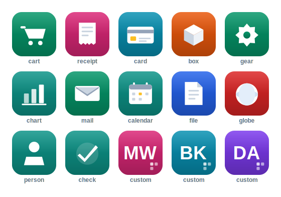
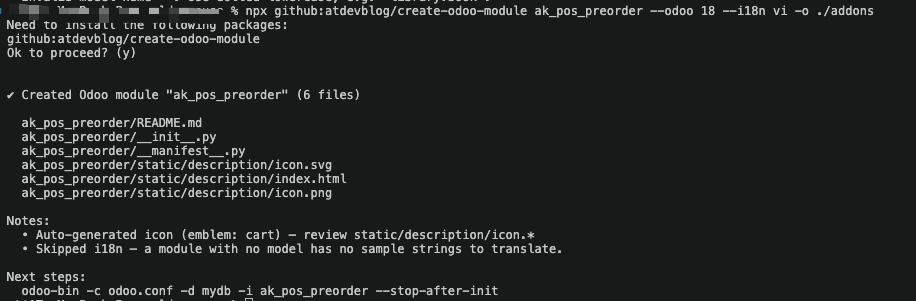

# create-odoo-module

Scaffold a ready-to-install **Odoo 17 / 18 / 19** module in one command — models,
list/form views, menus, pre-filled security, an **auto-generated icon**, and optional
**Vietnamese (i18n)**. Zero dependencies.

<p align="center">
  
</p>

## ⚡ Quick start

```bash
# Replace <your_module> / <your.model> with your own names — creates ./addons/<your_module>/
npx github:atdevblog/create-odoo-module <your_module> --model <your.model> -o ./addons

# Example — creates ./addons/sale_bonus/
npx github:atdevblog/create-odoo-module sale_bonus --model sale.bonus -o ./addons
```

<p align="center">
  
</p>

> **No install needed.** `npx` fetches and runs the generator from GitHub on the fly
> (into a temp cache, not your project) — the only thing written to disk is the module
> it creates. You just need **Node ≥ 18.3** and internet.

👉 **More examples** (deps, `--i18n vi`, Odoo 17, interactive) → see **Recipes** below.

Then open `<your_module>/`, adapt the model/views to your business, **and** install it into
Odoo the usual way (`-i <your_module>`) when you're done — the code is plain Python/XML for
Odoo 17/18/19.

## 🍳 Recipes (copy-paste)

```bash
# Install once, then use the short command anywhere
npm install -g github:atdevblog/create-odoo-module

# Interactive — prompts for every field
create-odoo-module

# Sales module: extra deps + Vietnamese translations, straight into your addons
create-odoo-module sale_bonus --model sale.bonus --depends base,sale --i18n vi -o ~/odoo/addons

# Target Odoo 17 (emits <tree> + 17.x version)
create-odoo-module legacy_mod --model my.model --odoo 17 -o ./addons

# Mark it as an application, set author + category
create-odoo-module fleet_extra --model fleet.note --app --author "You" --category Fleet

# Just preview the file list — write nothing
create-odoo-module demo --model demo.thing --dry-run

# No new model — inherit views / add data / glue. Just omit --model.
create-odoo-module ak_pos_preorder --depends base,point_of_sale -o ./addons
```

## Options

| Flag | What | Default |
|---|---|---|
| `<name>` | Module technical name, snake_case (positional) | **required** |
| `--model <m>` | Main model, dotted (`library.book`) — **omit for a no-model module** | optional |
| `--odoo <17\|18\|19>` | Target series (view syntax + version) | `18` |
| `--depends <list>` | Comma-separated dependencies | `base` |
| `--i18n <vi\|none>` | Add a pre-translated Vietnamese `vi.po` | `none` |
| `-o, --output <dir>` | Where to create the module | `.` |
| `--author` · `--version` · `--summary` · `--category` | Manifest fields | sensible |
| `--app` · `--force` · `-y, --yes` · `--dry-run` · `-h, --help` | flags | — |

## What you get

After running the command, you have an **install-ready** module:

```text
sale_bonus/                      # ← create-odoo-module sale_bonus --model sale.bonus --i18n vi
├── __manifest__.py              # name, version (18.0.1.0.0), depends, data, license
├── __init__.py
├── models/
│   ├── __init__.py
│   └── sale_bonus.py            # sample model — Char, Text, Many2one, Float, Date, Selection
├── views/
│   ├── sale_bonus_views.xml     # list + form views + window action
│   └── sale_bonus_menus.xml     # root menu + menu item
├── security/
│   └── ir.model.access.csv      # access rights — PRE-FILLED (the file devs forget)
├── static/description/
│   ├── icon.png                 # auto-generated — shows in the Odoo Apps list
│   ├── icon.svg                 # scalable companion
│   └── index.html               # module description page
├── i18n/                        # only with --i18n vi
│   ├── sale_bonus.pot           # translation template
│   └── vi.po                    # Vietnamese — sample strings pre-translated
└── README.md
```

> File names follow your model: `sale.bonus` → `sale_bonus.py`, `sale_bonus_views.xml`, etc.

- **Icon** = a domain emblem (`sale`→cart, `stock`→box, `account`→receipt, `report`→chart, …) or the module **initials** when nothing matches.
- **`--i18n vi`** pre-translates the sample strings (Customer → Khách hàng); Odoo loads `vi.po` for `vi_VN` users.
- View tag + manifest version auto-match `--odoo` (`<tree>` for 17, `<list>` for 18/19).

## 🇻🇳 Tiếng Việt

Lệnh giống hệt phần trên. Chọn `--odoo 17/18/19`, thêm `--i18n vi` để có bản dịch
tiếng Việt, `-o ./addons` để xuất thẳng vào addons:

```bash
npx github:atdevblog/create-odoo-module ten_module --model my.model --odoo 18 --i18n vi -o ./addons
```

> **Không cần cài package** — `npx` tự tải từ GitHub chạy ngay (vào cache tạm, không
> vào project), máy chỉ cần **Node ≥ 18.3** + mạng. Thứ lưu lại chỉ là module sinh ra.
>
> Đây là **khung khởi đầu** — đọc lại code và chỉnh field/quyền theo nghiệp vụ trước khi cài lên production.

## Dev

```bash
npm test   # node --test, no dependencies
```

The core (`src/core/`) does no disk I/O — it returns a `path → contents` map, reused
by the CLI and the web version at [atdev.blog](https://atdev.blog).

MIT © [atdev.blog](https://atdev.blog)
